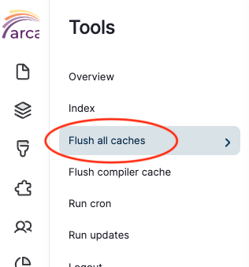

# Troubleshooting

This page will be populated with common troubleshooting tips for the new platform.

!!! tip
    Perennial tip for all circumstances: If something is going wrong, first, **try clearing the Drupal cache**.

    To do this, hover over the Arca icon in the administrative toolbar and select "Flush all caches".

    

For technical support, advice, or any other kind of help with your repository, please contact the Arca Office via our [support page](https://support.bceln.ca) or by email (arca-help [at] bceln.ca).

We will update this page with common bugs and possible solutions if and when they arise.